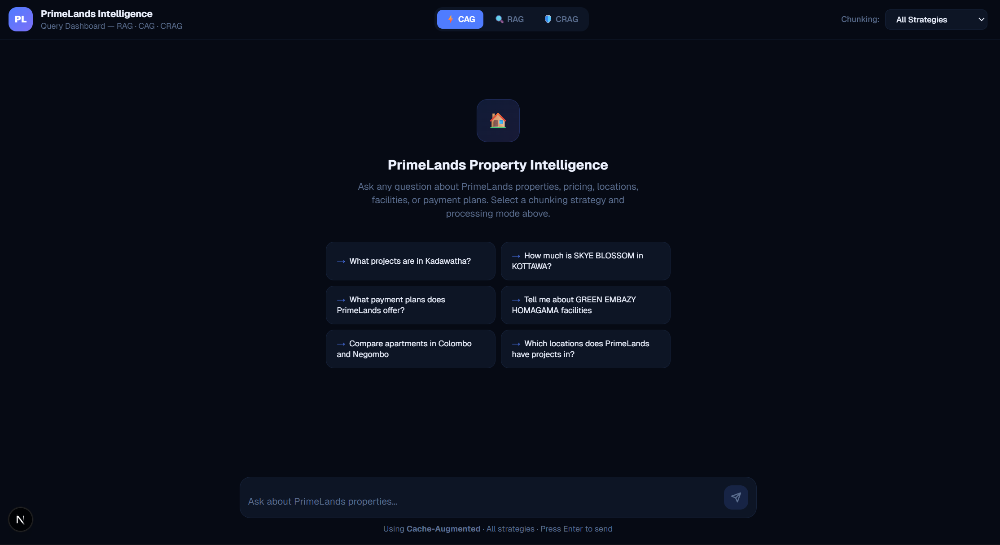

# 🏠 Real State Intelligence — PrimeLands RAG System

An end-to-end **Retrieval-Augmented Generation (RAG)** system for Sri Lanka's PrimeLands real estate platform. Crawls property listings, chunks and embeds documents using 5 strategies, and serves accurate, grounded answers through RAG, CAG (Cache-Augmented), and CRAG (Corrective RAG) pipelines.

## 🏗️ Architecture

```
User Query
    │
    ▼
┌──────────┐    HIT     ┌────────────┐
│ CAG Cache │──────────►│ Cached     │
│ (FAQ +    │           │ Response   │
│  History) │           └────────────┘
└────┬─────┘
     │ MISS
     ▼
┌──────────┐   Low Conf  ┌──────────┐
│   RAG    │────────────►│  CRAG    │
│ (k=4)   │             │ (k=8)   │
└────┬─────┘             └────┬─────┘
     │                        │
     ▼                        ▼
┌──────────────────────────────────┐
│   Qdrant Vector Store (2015     │
│   vectors, COSINE similarity)   │
└──────────────────────────────────┘
     │
     ▼
┌──────────────────────────────────┐
│   LLM Generation (Gemini Flash) │
│   + Grounded Answer with URLs   │
└──────────────────────────────────┘
```

## 📁 Project Structure

```
real_state/
├── notebooks/
│   ├── 01_crawl_primelands.ipynb    # Web crawling pipeline
│   ├── 02_chunk_and_embed.ipynb     # 5 chunking strategies + Qdrant indexing
│   ├── 03_chat_with_demo.ipynb      # RAG / CAG / CRAG interactive demo
│   └── 04_performance_arena.ipynb   # Full evaluation & benchmarking
├── src/real_state/
│   ├── application/
│   │   ├── chat_service/
│   │   │   ├── rag_service.py       # Standard RAG
│   │   │   ├── cag_service.py       # Cache-Augmented Generation
│   │   │   ├── cag_cache.py         # FAQ + history cache with embeddings
│   │   │   └── crag_service.py      # Corrective RAG with confidence scoring
│   │   ├── domain/
│   │   │   ├── utils.py             # format_docs, calculate_confidence
│   │   │   └── prompts/             # RAG prompt templates
│   │   └── ingest_document_service/
│   │       └── web_crawler.py       # Playwright-based async crawler
│   ├── infrastructure/
│   │   ├── db/vector_db.py          # QdrantStorage wrapper
│   │   └── llm_provider/            # OpenRouter / OpenAI LLM + embeddings
│   └── config.py                    # Central configuration
├── config/
│   ├── config.yaml                  # System parameters
│   ├── faqs.yaml                    # Pre-cached FAQ entries
│   └── models.yaml                  # Model configuration
├── data/                            # Crawled corpus, results, JSON outputs
├── main.py                          # Application entry point
└── pyproject.toml                   # Dependencies (uv)
```

## 🚀 Quick Start

### Prerequisites

- Python 3.13+
- [uv](https://docs.astral.sh/uv/) package manager
- API key: OpenRouter (recommended) or OpenAI

### Setup

```bash
# Clone and enter project
git clone https://github.com/Savidya-Nirthana/Real-state-intelligence.git
cd real_state

# Install dependencies
uv sync

# Configure environment
cp .env-example .env
# Edit .env and add your API key:
#   OPENROUTER_API_KEY=sk-or-...
```

### Run Notebooks

```bash
# Start Jupyter
jupyter notebook notebooks/

# Execute in order:
# 1. 01_crawl_primelands.ipynb  → Crawl 207 property pages
# 2. 02_chunk_and_embed.ipynb   → Chunk & embed into Qdrant
# 3. 03_chat_with_demo.ipynb    → Interactive RAG/CAG/CRAG demo
# 4. 04_performance_arena.ipynb → Full performance evaluation
```

## 📊 Key Results

### Chunking Strategy Comparison (10 queries × 5 strategies)

| Strategy     | Precision@5 | Recall@5  | Relevance | Latency | Composite |
| ------------ | ----------- | --------- | --------- | ------- | --------- |
| **🥇 Child** | **0.400**   | **0.623** | 0.515     | 5.42s   | **0.513** |
| 🥈 Fixed     | 0.200       | 0.553     | 0.510     | 4.56s   | 0.430     |
| 🥉 Sliding   | 0.260       | 0.503     | 0.501     | 4.86s   | 0.429     |
| Semantic     | 0.140       | 0.478     | 0.540     | 4.51s   | 0.401     |
| Late Chunk   | 0.160       | 0.503     | 0.450     | 4.43s   | 0.379     |

### CAG Cache Effectiveness (100-query simulation)

| Metric            | Value                      |
| ----------------- | -------------------------- |
| Cache Hit Rate    | **80.0%**                  |
| Latency Speedup   | **13.2×** (0.49s vs 6.42s) |
| Cost Reduction    | **76.2%** ($24/mo savings) |
| API Calls Avoided | 12,000/month               |

### CRAG Correction Impact (20 queries — RAG vs CRAG)

- Self-correcting retrieval for low-confidence queries
- Expanded retrieval (k=4 → k=8) improves confidence scores
- Results saved to `data/crag_comparison_results.csv`

## 🔧 Tech Stack

| Component           | Technology                                           |
| ------------------- | ---------------------------------------------------- |
| **Crawling**        | Playwright + BeautifulSoup                           |
| **Chunking**        | 5 strategies (Semantic, Fixed, Sliding, Child, Late) |
| **Embeddings**      | OpenAI `text-embedding-3-large`                      |
| **Vector Store**    | Qdrant (local, COSINE similarity)                    |
| **LLM**             | Google Gemini 2.5 Flash (via OpenRouter)             |
| **Framework**       | LangChain LCEL                                       |
| **Frontend**        | Next.js (React, TypeScript)                          |
| **Package Manager** | uv                                                   |

## 🖥️ Frontend UI

A sleek, dark-themed **Next.js** dashboard that lets you interact with the RAG system in real time. Switch between **CAG**, **RAG**, and **CRAG** processing modes, pick a chunking strategy, and get grounded answers with source links — all from one interface.

### Home — Query Dashboard



> The landing screen features quick-access **suggested queries**, a mode toggle bar (CAG · RAG · CRAG), and a chunking strategy selector. Type a question or click a suggestion to get started.

### Processing a Query (CRAG Mode)


> After submitting a query, a **loading indicator** shows the system is retrieving and scoring documents through the Corrective RAG pipeline.

### Grounded Response with Key Facts


> The response is structured into **Key Facts** (bullet-pointed with direct source links), a detailed **Answer** paragraph, and **Contact** information — all grounded in the retrieved documents.

### Response Metadata & Sources


> At the bottom of each response, metadata badges show the **pipeline used** (CRAG), **cache status** (Cache Miss → RAG), whether a **correction was applied**, response **latency**, and the number of **documents retrieved**. Confidence scores display the before → after improvement. Clickable **source links** let users verify answers directly on PrimeLands.

## 📦 Data Pipeline

1. **Crawl** — Playwright async crawler visits 207 PrimeLands property pages, extracts structured content (title, price, location, facilities, payment plans)
2. **Chunk** — Documents split using 5 strategies with configurable sizes (500-1500 tokens)
3. **Embed** — OpenAI `text-embedding-3-large` generates 3072-dim vectors
4. **Index** — Vectors stored in Qdrant with metadata (URL, strategy, project ID)
5. **Query** — User queries flow through CAG → RAG/CRAG → grounded answer with source URLs

## 📄 Generated Reports

| Report                                 | Description                              |
| -------------------------------------- | ---------------------------------------- |
| `data/chunking_comparison_results.csv` | Raw 50-run evaluation metrics            |
| `data/chunking_comparison_summary.csv` | Strategy-level aggregated scores         |
| `data/cag_stats.json`                  | CAG simulation results (structured JSON) |
| `data/crag_comparison_results.csv`     | RAG vs CRAG per-query comparison         |
| `data/crag_impact_summary.json`        | CRAG correction impact metrics           |
